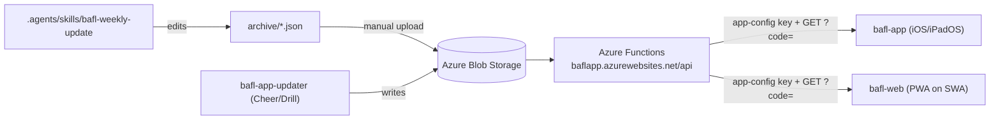

# AGENTS.md

This file explains how the parts of this repository relate and lists every rule, format, and constant that must stay in sync across them. Read it before changing data formats, league rules, API calls, or navigation in any app.

## Components

The repository holds two client apps, one editor tool, and the season data they share; the backend that serves the data lives outside the repository.

| Component | Location | What it is |
|---|---|---|
| **Mobile app** | `bafl-app/` | .NET MAUI app. Published on iOS and iPadOS. The Android build compiles but is not published (Google Play account closed). |
| **Web app** | `bafl-web/` | SvelteKit + TypeScript Progressive Web App (PWA), built as static files for Azure Static Web Apps (SWA). Independent of `bafl-app/`; it shares no code, only data formats and rules. |
| **Backend API** | Azure portal only | HTTP-triggered Azure Functions at `https://baflapp.azurewebsites.net/api`. **The source is not in this repository.** Endpoint changes happen in the portal. |
| **Data storage** | Azure Blob Storage | Holds the JSON files the Functions serve. |
| **Competition editor** | `bafl-app-updater/` | Streamlit tool that edits `CheerComp.json` and `DrillComp.json` in Blob Storage. It does not touch schedules or standings. |
| **Season data** | `archive/` | Source copies of season JSON (`GameSchedule.<year>.json`, `FootballStandings.<year>.json`, `Teams.<year>.json`, and others). **Uploaded to Blob Storage by hand**; nothing deploys them automatically. |
| **Format specs** | `docs/` | `game_schedule.md`, `football_standings.md`, and `azure-data-integration.md` define the JSON formats and API contract. |
| **Season seeding** | `utils/` | `generate_json.py` creates zeroed standings for a new season. |
| **Weekly update skill** | `.agents/skills/bafl-weekly-update/` | Agent skill that records weekly scores and standings into `archive/`, with `validate.py` and `derive_standings.py` checks. |

## Data flow

Data moves one way, from `archive/` and the editor into Blob Storage, then out through the Functions to both apps.

- **Both apps call the API the same way:** POST `{"context": "BaflApp"}` to `/api/app-config` to get a `Key`, then GET each endpoint with `?code=<Key>`.
- **The browser needs Cross-Origin Resource Sharing (CORS)** on the Function App. Its allowed origins must include every `bafl-web` hostname. The MAUI app does not need CORS.
- **9v9 is not used.** The `/api/calendar9v9` and `/api/standings9v9` endpoints return HTTP 404, the MAUI 9v9 views are commented out of the menu, and the web app has no 9v9 pages. Do not add 9v9 features.

## Keep in sync

Each row is a rule or format that lives in more than one place. **When one side changes, update every listed location in the same commit.**

| What | Locations |
|---|---|
| **JSON formats** (field names are case-sensitive) | `docs/game_schedule.md`, `docs/football_standings.md`, `docs/azure-data-integration.md`, `bafl-app/Library/*.cs`, `bafl-web/src/lib/types.ts`, `.agents/skills/bafl-weekly-update/scripts/validate.py` |
| **Score format:** `"<away> @ <home>"`, away score first; forfeits `"1 @ 0"` or `"0 @ 1"`; unplayed `"TBA"` | `docs/game_schedule.md`, `bafl-app/ScheduleView.xaml`, `bafl-web/src/lib/components/ScheduleView.svelte`, `derive_standings.py`, `validate.py` |
| **Matchup display:** Away team on top, then `@ Home`; `vs` when `IsNeutral` is true; `BYE` entries have `Home: "BYE"` and no `Scores` | `docs/game_schedule.md`, `bafl-app/Library/BaflGameMatchup.cs`, `bafl-web/src/lib/schedule.ts` |
| **Postseason semantics** (different score meaning; see the spec) | `docs/game_schedule.md`, the weekly update skill |
| **Level names and order:** Peewee, Freshman, Sophomore, Junior, Senior | All season JSON, `bafl-app/Library/`, `bafl-web/src/lib/types.ts`, skill scripts |
| **Team names** | `archive/Teams.<year>.json`, `archive/GameSchedule.<year>.json`, `archive/FootballStandings.<year>.json`, `validate.py` |
| **Standings math:** Points = Wins + 0.5 × Ties; tied teams share a rank; teams sorted by Rank then name; playoff marker when `Playoff` is true | `docs/football_standings.md`, `bafl-app/Library/BaflStandingTeam.cs`, `bafl-app/StandingsView.xaml.cs`, `bafl-web/src/lib/standings.ts`, `validate.py` |
| **"Current week" choice:** first week whose date plus 2 days is after now, else the last week | `bafl-app/ScheduleView.xaml.cs` (`FindClosestWeek`), `bafl-web/src/lib/schedule.ts` |
| **API base URL, endpoint paths, key flow** | `bafl-app/Library/BaflUtilities.cs`, `bafl-app/App.xaml.cs`, `bafl-web/src/lib/api.ts`, `docs/azure-data-integration.md`, the Function App |
| **Play Monitor rules:** 8 plays for Peewee, 12 for Freshman through Senior, half of that for half-play players; play counts cap at the target | `bafl-app/Library/BaflUtilities.cs`, `bafl-app/Library/BaflPlayerMonitor.cs`, `bafl-app/Library/BaflTeamMonitor.cs`, `bafl-web/src/lib/playMonitor.ts` |
| **Play Monitor file format:** `SBaflTeamMonitor` with `Players` as a list of JSON-encoded `SBaflPlayerMonitor` strings; `NotPlayReason` integers 0 to 6 | `bafl-app/Library/BaflPlayerMonitor.cs`, `bafl-app/Library/BaflTeamMonitor.cs`, `bafl-web/src/lib/playMonitor.ts`. Files must round-trip between iOS and web. |
| **Age and weight rules:** age on August 1 of the current year; football levels by age (Peewee 5–6, Freshman 7–8, Sophomore 9, Junior 10, Senior 11–12); weight limits 130, 150, 170, 190, 210 lbs; cheer and drill levels | `bafl-app/AgeWeightCalcView.xaml.cs`, `bafl-web/src/lib/ageLevel.ts` |
| **Bundled fallback data** used before the first successful API call | `bafl-web/static/data/{Teams,Board,Schedule}.json`; refresh it from `/api/coreinfo` each season. `bafl-app/Resources/Raw/` is a historical snapshot and does not need to match. |
| **Menu order and external links** (website, Facebook, by-laws, NWS alerts, contact) | `bafl-app/AppShell.xaml`, `bafl-app/AppShell.xaml.cs`, `bafl-app/MainPage.xaml.cs`, `bafl-web/src/lib/navigation.ts` |
| **Brand colors:** Primary `#1C154D`, Secondary `#E4001C` | `bafl-app/Resources/Styles/Colors.xaml`, `bafl-web/src/app.css` |
| **CORS allowed origins** | Function App `baflapp` CORS settings must list every `bafl-web` hostname. Today: `https://app.bayareafootballleague.org` and `https://blue-plant-07b93f610.2.azurestaticapps.net` (plus `https://portal.azure.com`). Add any new hostname here before pointing DNS at the site. |

## Web app commands

Run these from `bafl-web/` with Node 22 or later.

- **`npm install`** installs dependencies.
- **`npm run dev`** serves the app at `http://localhost:5173`. The dev server proxies `/api` to the Function App, so local work does not need CORS.
- **`npm test`** runs the Vitest unit tests for the shared rules.
- **`npm run check`** runs TypeScript and Svelte checks.
- **`npm run build`** writes the static site to `bafl-web/build/`. `static/staticwebapp.config.json` holds the SWA routing fallback and headers.

## Web app hosting

The web app runs on a Free-tier Azure Static Web App; pushes to `main` that touch `bafl-web/` deploy it.

- **Resource:** Static Web App `bafl-web` in resource group `BAFLApp` (subscription "Core VS Enterprise Subscriptino"), region Central US.
- **Delete lock:** `protect-bafl-web` (CanNotDelete) blocks accidental deletion, which would lose the default hostname and the custom domain binding. Remove the lock first if deletion is really intended.
- **URL:** `https://app.bayareafootballleague.org` (public address). It is a CNAME in Wix DNS pointing at the default host `https://blue-plant-07b93f610.2.azurestaticapps.net`, which also keeps working.
- **Pipeline:** `.github/workflows/bafl-web.yml` runs `npm ci`, `check`, `test`, and `build`, then uploads `bafl-web/build`. It authenticates with the repository secret `AZURE_STATIC_WEB_APPS_API_TOKEN_BAFL_WEB`.
- **Manual deploy:** from `bafl-web/`, run `npx @azure/static-web-apps-cli deploy ./build --env production` with the deployment token from `az staticwebapp secrets list`.
- **No PR previews:** preview hostnames are not in the Function App CORS list, so their API calls would fail.

## Rules for agents

These rules prevent the mistakes that are easiest to make in this repository.

- **Never edit `*.clean.json`.** They are empty-season templates.
- **Edits to `archive/` do not reach users** until someone uploads the file to Blob Storage. Say so when you finish an `archive/` change.
- **Do not change `bafl-app/` when working on `bafl-web/`,** and the reverse, unless the task is to change a shared rule. In that case, change both and their tests together.
- **Keep the web app's tests passing** (`npm test` in `bafl-web/`). They encode the Play Monitor, age and weight, standings, and schedule rules listed above.
- **Do not log or commit the API key.** It is fetched at runtime and must stay out of source, logs, and screenshots.
- **Use the weekly update skill** for score and standings updates; it enforces the formats above.

## Deferred work

These items are known and intentionally postponed.

- **Rate limiting** on the Function App: after the web app is live.
- **Google Play return:** a new developer account, or wrapping `bafl-web` as a Trusted Web Activity (TWA), is a later decision.
- **Payment pages** (Square, Zelle, CashApp) are not in the first web release.
