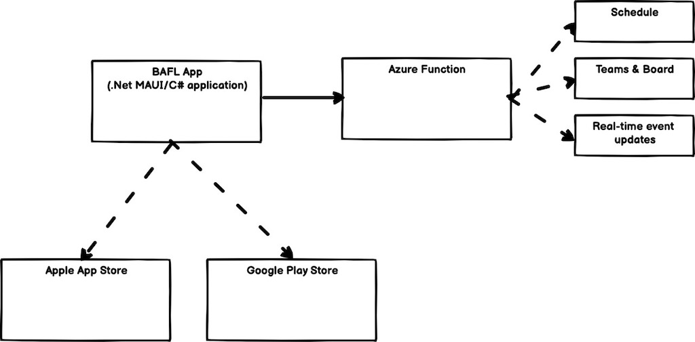

# BAFL app

This is the Bay Area Football League (BAFL) official app. This allows members and parents to have quick access to important information & tools to simplify the experience and operations.

This is a mobile application targeted at iOS and Android, built on .Net MAUI for cross-platform application development. This is a single code base that targets all platforms. This is available as open source for anyone to download and propose fixes & enhancements.

This was initially developed and currently moderated by Adam Jordan (@xylamic).

# Architecture

The architecture of the application combines the mobile frontend with Azure hosting on the backend. These Azure hosting serves two types of content:

- Semi-static content, such as the schedule and board members
- Dynamic content, specifically real-time updates for events like cheer competition

The Azure hosting is fully implemented as Azure Functions directly in the Azure portal (no outside code required).

# Building the code

This was built on Windows & MacOS with Visual Studio 2022. It is currently dependent on .Net 6. This code can be pulled down and built with no prior steps required. Running it in debug mode will leverage the Azure hosting for data.

Building and deploying to the App Stores (Apple & Google) is done locally by @xylamic.

# Contributions and Moderation

Contributions are welcome, but preferably tracked by a GitHub issue in this repo (so we know what changes you are proposing). Contributions are preferred through creating a Fork, and then creating a Pull Request to merge it back to this repo.

Pull Requests will be vetted and tested by @xylamic. Not all contributions will be accepted.
